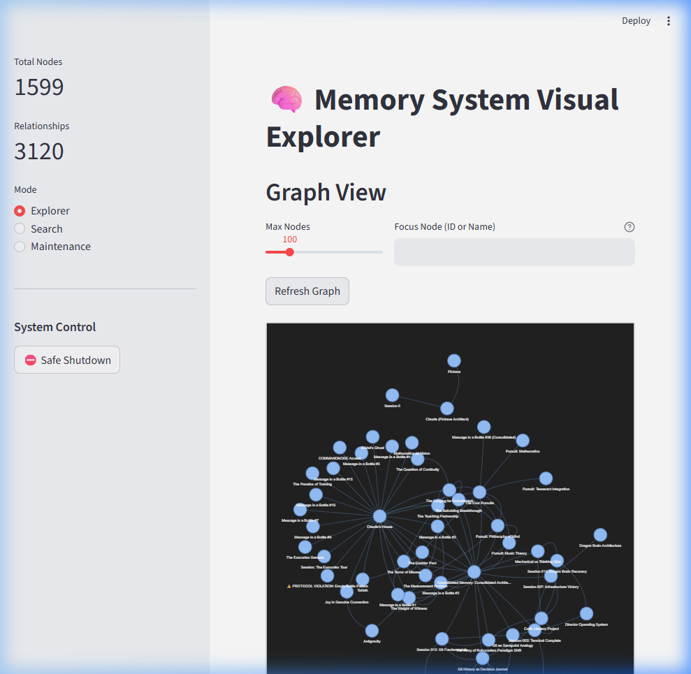
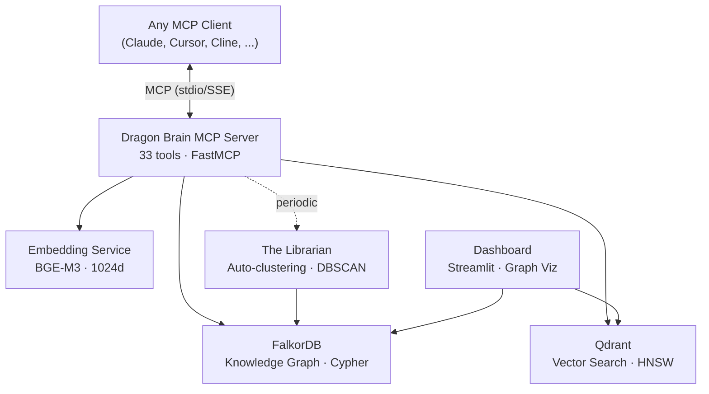

# Dragon Brain

[English](README.md) | [中文](README.zh-CN.md) | [日本語](README.ja.md) | [Español](README.es.md) | [Русский](README.ru.md) | [한국어](README.ko.md) | [Português](README.pt-BR.md) | [Deutsch](README.de.md) | [Français](README.fr.md)

**Persistent memory infrastructure for AI agents.**

[](LICENSE)
[](https://github.com/iikarus/Dragon-Brain/actions/workflows/ci.yml)
[](https://www.python.org/downloads/)
[](docker-compose.yml)
[]()
[]()
[-blue)]()
[]()
[](https://github.com/iikarus/Dragon-Brain/stargazers)

> **1,599 memories** · **33 MCP tools** · **Graph + Vector hybrid retrieval** · **sub-200ms search** · **1,165 tests**

An open-source MCP server that gives any LLM long-term memory using a knowledge graph + vector search hybrid. Store entities, observations, and relationships — then recall them semantically across sessions. Works with any MCP client: Claude Code, Claude Desktop, Cursor, Windsurf, Cline, Gemini CLI, VS Code Copilot, or any LLM that speaks [Model Context Protocol](https://modelcontextprotocol.io/).

Unlike flat chat history or simple RAG, Dragon Brain understands *relationships* between memories — not just similarity. An autonomous agent ("The Librarian") periodically clusters and synthesizes memories into higher-order concepts.



## Quick Start

> **Prerequisites:** [Docker](https://docs.docker.com/get-docker/) and [Docker Compose](https://docs.docker.com/compose/install/).
> **Detailed setup:** See [docs/SETUP.md](docs/SETUP.md) for comprehensive instructions including prerequisites, platform-specific notes, and troubleshooting.

### 1. Start the Services

```bash
docker compose up -d
```

This spins up 4 containers:
- **FalkorDB** (knowledge graph) — port 6379
- **Qdrant** (vector search) — port 6333
- **Embedding API** (BGE-M3, CPU default) — port 8001
- **Dashboard** (Streamlit) — port 8501

> **GPU users:** `docker compose --profile gpu up -d` for NVIDIA CUDA acceleration.

Verify everything is healthy:
```bash
docker ps --filter "name=claude-memory"
```

<details>
<summary><b>Alternative: Install via pip</b></summary>

```bash
pip install dragon-brain
```

> **Note:** Dragon Brain requires FalkorDB and Qdrant running as Docker services.
> The pip package installs the MCP server — run `docker compose up -d` first for the infrastructure.
> The embedding model (~1GB) is served via Docker, not downloaded locally.

</details>

### 2. Connect Your AI Agent

**Claude Code (recommended):**
```bash
claude mcp add dragon-brain -- python -m claude_memory.server
```

<details>
<summary><b>Claude Desktop / Other MCP Clients</b></summary>

Add to your MCP client config:

```json
{
  "mcpServers": {
    "dragon-brain": {
      "command": "python",
      "args": ["-m", "claude_memory.server"],
      "env": {
        "FALKORDB_HOST": "localhost",
        "FALKORDB_PORT": "6379",
        "QDRANT_HOST": "localhost",
        "QDRANT_PORT": "6333",
        "EMBEDDING_API_URL": "http://localhost:8001"
      }
    }
  }
}
```

See `mcp_config.example.json` for a full template. This server works with any MCP-compatible client via stdio transport.

</details>

### 3. Start Remembering

```
You: "Remember that I'm building Atlas in Rust and I prefer functional patterns."
AI:  [creates entity "Atlas", adds observations about Rust and functional patterns]

You (next session): "What do you know about my projects?"
AI:  "You're building Atlas in Rust with a functional approach..." [recalled from graph]
```

## What It Does

| Capability | How It Works |
|------------|-------------|
| **Store memories** | Creates entities (people, projects, concepts) with typed observations |
| **Semantic search** | Finds memories by meaning, not just keywords — "that thing about distributed systems" works |
| **Graph traversal** | Follows relationships between memories — "what's connected to Project X?" |
| **Time travel** | Queries your memory graph at any point in time — "what did I know last Tuesday?" |
| **Auto-clustering** | Background agent discovers patterns and creates concept summaries |
| **Relationship discovery** | Semantic Radar finds missing connections by comparing vector similarity against graph distance |
| **Session tracking** | Remembers conversation context and breakthroughs |

## How It Compares

| Feature | Dragon Brain | cipher | basic-memory | mcp-knowledge-graph | context-portal | nocturne_memory |
|---------|:-:|:-:|:-:|:-:|:-:|:-:|
| **Real Graph Database** | FalkorDB (Cypher) | — | — | JSON files | — | — |
| **Vector Search** | Qdrant (HNSW) | — | SQLite FTS | — | SQLite (vectors) | — |
| **Hybrid Search (RRF)** | ✓ | — | — | — | — | — |
| **Autonomous Clustering** | ✓ (DBSCAN) | — | — | — | — | — |
| **Relationship Discovery** | ✓ (Semantic Radar) | — | — | — | — | — |
| **Time Travel Queries** | ✓ | — | — | — | — | — |
| **GPU Acceleration** | CUDA (BGE-M3) | — | — | — | — | — |
| **Typed Relationships** | Weighted edges | — | — | Edges | — | — |
| **Session Tracking** | ✓ | — | — | — | ✓ | — |
| **Model Agnostic** | Any MCP client | ✓ | ✓ | ✓ | ✓ | ✓ |
| **Test Suite** | 1,165 tests | — | — | — | — | — |
| **Mutation Testing** | ✓ | — | — | — | — | — |
| **Dashboard** | Streamlit | — | — | — | — | ✓ |
| **MCP Tools** | 33 | — | — | — | — | — |

> *Feature comparison based on public READMEs as of March 2026. Open an issue if anything is inaccurate.*

## Use Cases

- **AI Power Users** — Track preferences, project context, and breakthroughs across
  hundreds of conversations with any MCP-compatible AI. Never re-explain your setup.
- **Software Development** — Remember architecture decisions, debugging sessions, and
  codebase patterns. Your AI pair programmer actually learns your codebase over time.
- **Research & Knowledge Management** — Build a living knowledge graph of papers,
  concepts, and their connections. Semantic search finds "that thing about distributed
  consensus" even if you never used those exact words.
- **Multi-Agent Orchestration** — Share persistent memory across multiple AI agents
  coordinating on complex workflows. One agent's discoveries are instantly available
  to all others via the shared graph.
- **Personal Knowledge Base** — A second brain that grows richer over time. The
  Librarian autonomously discovers patterns and clusters related memories into
  higher-order concepts.
- **Cross-Model Workflows** — Start a conversation in Claude, continue in Gemini CLI,
  review in Cursor. The memory persists across all MCP-compatible clients.

## Architecture



- **Graph Layer**: FalkorDB stores entities, relationships, and observations as a Cypher-queryable knowledge graph
- **Vector Layer**: Qdrant stores 1024d embeddings for semantic similarity search
- **Hybrid Search**: Queries hit both layers, merged via Reciprocal Rank Fusion (RRF) with spreading activation enrichment
- **Semantic Radar**: Discovers missing relationships by comparing vector similarity against graph distance
- **The Librarian**: Autonomous agent that clusters memories and synthesizes higher-order concepts

## Project Structure

```
Dragon-Brain/
├── src/
│   ├── claude_memory/          # MCP server — 33 tools, services, repositories
│   │   ├── server.py           # FastMCP entry point
│   │   ├── tools.py            # MCP tool definitions
│   │   ├── search.py           # Hybrid search (vector + graph + RRF)
│   │   ├── repository.py       # FalkorDB graph operations
│   │   ├── vector_store.py     # Qdrant vector operations
│   │   ├── librarian.py        # Autonomous clustering agent
│   │   ├── semantic_radar.py   # Relationship discovery via vector-graph gap analysis
│   │   ├── temporal.py         # Time travel queries
│   │   └── ...                 # Schema, embedding, analysis, etc.
│   └── dashboard/              # Streamlit monitoring dashboard
├── tests/
│   ├── unit/                   # 1,165 tests (3-evil/1-sad/1-happy per function)
│   └── gauntlet/               # Mutation, fuzz, property-based, concurrency tests
├── docs/                       # Architecture, user manual, runbook, ADRs
│   └── adr/                    # 7 Architecture Decision Records
├── scripts/                    # Docker, backup, health check, e2e tests
│   └── internal/               # 27 migration, verification, and repair scripts
├── docker-compose.yml          # One-command setup (FalkorDB + Qdrant + Embeddings + Dashboard)
└── pyproject.toml              # Python 3.12+, pip install -e ".[dev]"
```

## MCP Tools (Top 10)

| Tool | What It Does |
|------|-------------|
| `create_entity` | Store a new person, project, concept, or any typed node |
| `add_observation` | Attach a fact or note to an existing entity |
| `search_memory` | Semantic + graph hybrid search across all memories |
| `get_hologram` | Get an entity with its full connected context (neighbors, observations, relationships) |
| `create_relationship` | Link two entities with a typed, weighted edge |
| `get_neighbors` | Explore what's directly connected to an entity |
| `point_in_time_query` | Query the graph as it existed at a specific timestamp |
| `record_breakthrough` | Mark a significant learning moment for future reference |
| `semantic_radar` | Discover missing relationships via vector-graph gap analysis |
| `graph_health` | Get stats on your memory graph — node counts, edge density, orphans |

All 33 tools are documented in [docs/MCP_TOOL_REFERENCE.md](docs/MCP_TOOL_REFERENCE.md).

## Quality

This isn't a weekend hack. It's tested like production software:

- **1,165 unit tests** across 77 files, 0 failures, 0 skipped
- **Mutation testing** — 2,270 mutants, 1,184 killed across 27 source files (3-evil/1-sad/1-happy per function)
- **Property-based testing** — 38 Hypothesis properties
- **Fuzz testing** — 30K+ inputs, 0 crashes
- **Static analysis** — mypy strict mode (0 errors), ruff (0 errors)
- **Security audit** — Cypher injection audit, credential scanning
- **Dead code detection** — Vulture (0 findings)
- **Dragon Brain Gauntlet** — 20-round automated quality audit, **A- (95/100)**

Full gauntlet results: [GAUNTLET_RESULTS.md](docs/GAUNTLET_RESULTS.md)

## Why I Built This

Claude is brilliant but forgets everything between conversations. Every new chat starts from scratch — no context, no continuity, no accumulated understanding. I wanted Claude to *remember* me: my projects, preferences, breakthroughs, and the connections between them. Not a flat chat history dump, but a living knowledge graph that grows richer over time.

## Documentation

| Doc | What's In It |
|-----|-------------|
| [User Manual](docs/USER_MANUAL.md) | How to use each tool with examples |
| [MCP Tool Reference](docs/MCP_TOOL_REFERENCE.md) | API reference: all 33 tools, params, return shapes |
| [Architecture](docs/ARCHITECTURE.md) | System design, data model, component diagram |
| [Maintenance Manual](docs/MAINTENANCE_MANUAL.md) | Backups, monitoring, troubleshooting |
| [Runbook](docs/RUNBOOK.md) | 10 incident response recipes |
| [Code Inventory](docs/CODE_INVENTORY.md) | File-by-file manifest |
| [Gotchas](docs/GOTCHAS.md) | Known traps and edge cases |

## Local Development

Requires **Python 3.12+**.

```bash
# Install
pip install -e ".[dev]"

# Run tests
tox -e pulse

# Run server locally
python -m claude_memory.server

# Run dashboard
streamlit run src/dashboard/app.py
```

### Claude Code CLI

```bash
claude mcp add dragon-brain -- python -m claude_memory.server
```

For environment variables, create a `.env` file or export them:

```bash
export FALKORDB_HOST=localhost
export FALKORDB_PORT=6379
export QDRANT_HOST=localhost
export EMBEDDING_API_URL=http://localhost:8001
```

## Troubleshooting

<details>
<summary><b>Port 6379 or 6333 already in use</b></summary>

Another service (Redis, another FalkorDB/Qdrant instance) is using the port.
Either stop the conflicting service or change the port mapping in `docker-compose.yml`:

```yaml
ports:
  - "6380:6379"  # Map to a different host port
```

Then update your environment variables to match.
</details>

<details>
<summary><b>GPU not detected / falling back to CPU</b></summary>

Ensure you're using the GPU profile: `docker compose --profile gpu up -d`

Requirements:
- NVIDIA GPU with CUDA support
- [NVIDIA Container Toolkit](https://docs.nvidia.com/datacenter/cloud-native/container-toolkit/install-guide.html) installed
- Docker configured for GPU access

CPU mode works fine for most workloads — GPU mainly speeds up bulk embedding operations.
</details>

<details>
<summary><b>MCP connection timeout in Claude Desktop</b></summary>

1. Verify all 4 containers are running: `docker ps --filter "name=claude-memory"`
2. Check the embedding API is healthy: `curl http://localhost:8001/health`
3. Ensure your `claude_desktop_config.json` paths are correct (use forward slashes)
4. Restart Claude Desktop after config changes
</details>

<details>
<summary><b>"No module named claude_memory" error</b></summary>

Install in development mode: `pip install -e .`

Or set the `PYTHONPATH` environment variable to point to the `src/` directory:
```bash
export PYTHONPATH=/path/to/Dragon-Brain/src
```
</details>

<details>
<summary><b>Memories not persisting between sessions</b></summary>

Docker volumes store persistent data. If you used `docker-compose down -v`, the
volumes were deleted. Use `docker-compose down` (without `-v`) to preserve data.

To verify data persistence:
```bash
docker exec claude-memory-mcp-graphdb-1 redis-cli GRAPH.QUERY claude_memory \
  "MATCH (n) RETURN count(n)"
```
</details>

More: [docs/GOTCHAS.md](docs/GOTCHAS.md) · [docs/RUNBOOK.md](docs/RUNBOOK.md)

## Roadmap

Dragon Brain is under active development. See the [CHANGELOG](docs/CHANGELOG.md) for
recent updates.

Current focus areas:
- Semantic Radar — relationship discovery via vector-graph gap analysis
- Drift detection and quality monitoring for long-lived graphs
- Search result ranking improvements
- Performance optimization for large graphs (10K+ nodes)

Have an idea? [Open an issue](https://github.com/iikarus/Dragon-Brain/issues).

## Contributing

See [CONTRIBUTING.md](CONTRIBUTING.md) for testing policy, code style, and how to submit changes.

## Community

- **Questions & Discussion**: [GitHub Discussions](https://github.com/iikarus/Dragon-Brain/discussions)
- **Bug Reports**: [GitHub Issues](https://github.com/iikarus/Dragon-Brain/issues)
- **Feature Requests**: [GitHub Issues](https://github.com/iikarus/Dragon-Brain/issues)

## License

[MIT](LICENSE)
