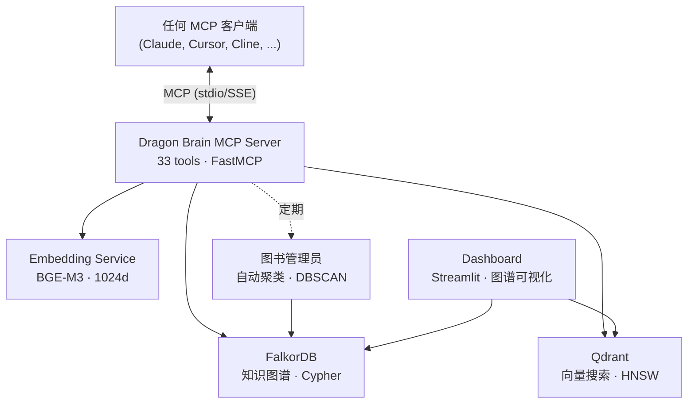

# Dragon Brain

[English](README.md) | [中文](README.zh-CN.md) | [日本語](README.ja.md) | [Español](README.es.md) | [Русский](README.ru.md) | [한국어](README.ko.md) | [Português](README.pt-BR.md) | [Deutsch](README.de.md) | [Français](README.fr.md)

**为 AI 智能体提供持久记忆基础设施。**

[](LICENSE)
[](https://www.python.org/downloads/)
[](docker-compose.yml)
[]()
[]()
[-blue)]()
[]()
[](https://github.com/iikarus/Dragon-Brain/stargazers)

> **1,599 条记忆** · **33 个 MCP 工具** · **知识图谱 + 向量搜索混合检索** · **亚200毫秒搜索** · **1,165 个测试**

一个开源 MCP 服务器，通过知识图谱 + 向量搜索混合架构为任何 LLM 提供长期记忆。存储实体、观察和关系——然后跨会话进行语义召回。兼容所有 MCP 客户端：Claude Code、Claude Desktop、Cursor、Windsurf、Cline、Gemini CLI。

不同于扁平的聊天历史或简单的 RAG，Dragon Brain 理解记忆之间的*关系*——不仅仅是相似性。自主代理（"图书管理员"）会定期聚类并合成高阶概念。

## 快速开始

> **前置条件：** [Docker](https://docs.docker.com/get-docker/) 和 [Docker Compose](https://docs.docker.com/compose/install/)。
> **详细设置：** 参见 [docs/SETUP.md](docs/SETUP.md) 获取平台特定说明和故障排除。

### 1. 启动服务

```bash
docker compose up -d
```

启动4个容器：
- **FalkorDB**（知识图谱）— 端口 6379
- **Qdrant**（向量搜索）— 端口 6333
- **Embedding API**（BGE-M3，默认 CPU）— 端口 8001
- **Dashboard**（Streamlit）— 端口 8501

> **GPU 用户：** 使用 `docker compose --profile gpu up -d` 启用 NVIDIA CUDA 加速。

验证所有服务健康：
```bash
docker ps --filter "name=claude-memory"
```

### 通过 pip 安装

```bash
pip install dragon-brain
```

> **注意：** Dragon Brain 需要 FalkorDB 和 Qdrant 作为 Docker 服务运行。
> pip 包安装 MCP 服务器——请先运行 `docker compose up -d` 启动基础设施。
> Embedding 模型（约1GB）通过 Docker 提供，不需要本地下载。

### 2. 连接你的 AI 智能体

**Claude Code（推荐）：**
```bash
claude mcp add dragon-brain -- python -m claude_memory.server
```

<details>
<summary><b>Claude Desktop / 其他 MCP 客户端</b></summary>

添加到你的 MCP 客户端配置：

```json
{
  "mcpServers": {
    "dragon-brain": {
      "command": "python",
      "args": ["-m", "claude_memory.server"],
      "env": {
        "FALKORDB_HOST": "localhost",
        "FALKORDB_PORT": "6379",
        "QDRANT_HOST": "localhost",
        "QDRANT_PORT": "6333",
        "EMBEDDING_API_URL": "http://localhost:8001"
      }
    }
  }
}
```

完整模板参见 `mcp_config.example.json`。

</details>

### 3. 开始记忆

```
你: "记住我正在用 Rust 构建 Atlas 项目，我偏好函数式模式。"
AI:  [创建实体 "Atlas"，添加关于 Rust 和函数式模式的观察]

你（下一次会话）: "你知道我的项目吗？"
AI:  "你正在用 Rust 构建 Atlas，采用函数式方法..." [从知识图谱召回]
```

## 竞品对比

| 特性 | 聊天历史 | 简单 RAG | Dragon Brain |
|------|:--------:|:--------:|:------------:|
| 跨会话持久化 | 否 | 视情况 | **是** |
| 理解关系 | 否 | 否 | **是（图谱）** |
| 语义搜索 | 否 | 是 | **是（混合）** |
| 时间旅行查询 | 否 | 否 | **是** |
| 自动聚类 | 否 | 否 | **是（图书管理员）** |
| 关系发现 | 否 | 否 | **是（语义雷达）** |
| 兼容任何 MCP 客户端 | 不适用 | 不一定 | **是** |

## 功能

| 功能 | 工作原理 |
|------|---------|
| **存储记忆** | 创建实体（人物、项目、概念）并附加类型化的观察 |
| **语义搜索** | 通过含义查找记忆，不仅仅是关键词——"那个关于分布式系统的东西"也能找到 |
| **图谱遍历** | 追踪记忆之间的关系——"与 X 项目相关的一切是什么？" |
| **时间旅行** | 查询任意时间点的记忆图谱——"上周二我知道些什么？" |
| **自动聚类** | 后台代理发现模式并创建概念摘要 |
| **关系发现** | 语义雷达通过比较向量相似度和图谱距离来发现缺失的连接 |
| **会话追踪** | 记住对话上下文和关键突破 |

## 架构



- **图谱层**：FalkorDB 将实体、关系和观察存储为可 Cypher 查询的知识图谱
- **向量层**：Qdrant 存储 1024 维嵌入用于语义相似度搜索
- **混合搜索**：查询同时命中两层，通过倒数排名融合（RRF）合并结果，并用扩散激活进行增强
- **语义雷达**：通过比较向量相似度和图谱距离来发现缺失的关系
- **图书管理员**：自主代理，聚类记忆并合成高阶概念


## MCP 工具（前 10 个）

| 工具 | 功能 |
|------|------|
| `create_entity` | 存储新的人物、项目、概念或任何类型节点 |
| `add_observation` | 为已有实体添加事实或笔记 |
| `search_memory` | 语义 + 图谱混合搜索所有记忆 |
| `get_hologram` | 获取实体及其完整上下文（邻居、观察、关系） |
| `create_relationship` | 用类型化的加权边连接两个实体 |
| `get_neighbors` | 探索与实体直接连接的内容 |
| `point_in_time_query` | 查询特定时间戳的图谱状态 |
| `record_breakthrough` | 标记重要的学习时刻以便未来参考 |
| `semantic_radar` | 通过向量-图谱差距分析发现缺失的关系 |
| `graph_health` | 获取记忆图谱的统计信息——节点数、边密度、孤岛 |

全部 33 个工具的文档见 [docs/MCP_TOOL_REFERENCE.md](docs/MCP_TOOL_REFERENCE.md)。

## 为什么我要做这个

Claude 非常聪明但会忘记对话之间的一切。每次新聊天都从零开始——没有上下文、没有连续性、没有积累的理解。我希望 Claude 能*记住*我：我的项目、偏好、突破，以及它们之间的联系。不是扁平的聊天记录导出，而是一个随时间不断丰富的活的知识图谱。

## 质量

生产级测试：**1,165 个单元测试** · 变异测试（3恶/1悲/1喜）· 基于属性的测试（38 个 Hypothesis 属性）· 模糊测试（30K+ 输入，0 崩溃）· 静态分析（mypy 严格模式，ruff）· 安全审计 · **Gauntlet 评分：A-（95/100）**。

完整结果：[GAUNTLET_RESULTS.md](docs/GAUNTLET_RESULTS.md)

## 使用场景

- **长期项目** — 在数周/数月内积累上下文。Dragon Brain 记住架构决策、突破和背后的推理。
- **研究** — 创建论文、概念和连接的持久知识图谱。语义搜索通过含义而非关键词找到相关记忆。
- **多智能体系统** — 智能体团队的共享记忆层。一个智能体的发现可以立即被其他智能体搜索到。
- **个人知识管理** — 你的 AI 随时间学习你的偏好、工作风格和领域专长。

## 故障排除

| 问题 | 解决方案 |
|------|---------|
| MCP 工具未显示 | MCP 失败是**静默的**。检查 `docker ps --filter "name=claude-memory"` — 所有 4 个容器应处于健康状态。 |
| `search_memory` 返回空 | 验证 Embedding 服务在端口 8001 运行。检查 `curl http://localhost:8001/health`。 |
| 图谱名称混淆 | FalkorDB 图谱名称为 `claude_memory`（不是 `dragon_brain`）。直接 Cypher 查询时使用此名称。 |

更多：[docs/GOTCHAS.md](docs/GOTCHAS.md) · [docs/RUNBOOK.md](docs/RUNBOOK.md)

## 文档

| 文档 | 内容 |
|------|------|
| [用户手册](docs/USER_MANUAL.md) | 每个工具的使用方法和示例 |
| [MCP 工具参考](docs/MCP_TOOL_REFERENCE.md) | API 参考：全部 33 个工具、参数、返回格式 |
| [架构](docs/ARCHITECTURE.md) | 系统设计、数据模型、组件图 |
| [维护手册](docs/MAINTENANCE_MANUAL.md) | 备份、监控、故障排除 |
| [运维手册](docs/RUNBOOK.md) | 10 个事件响应方案 |
| [代码清单](docs/CODE_INVENTORY.md) | 逐文件清单 |
| [已知陷阱](docs/GOTCHAS.md) | 已知的陷阱和边界情况 |

## 本地开发

需要 **Python 3.12+**。

```bash
# 安装
pip install -e ".[dev]"

# 运行测试
tox -e pulse

# 本地运行服务器
python -m claude_memory.server

# 运行仪表盘
streamlit run src/dashboard/app.py
```

## 贡献

参见 [CONTRIBUTING.md](CONTRIBUTING.md) 了解测试策略、代码风格和如何提交更改。

## 许可证

[MIT](LICENSE)
